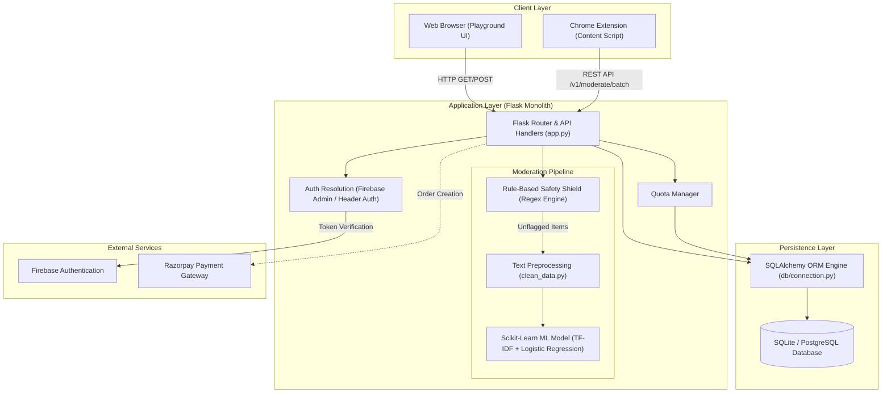
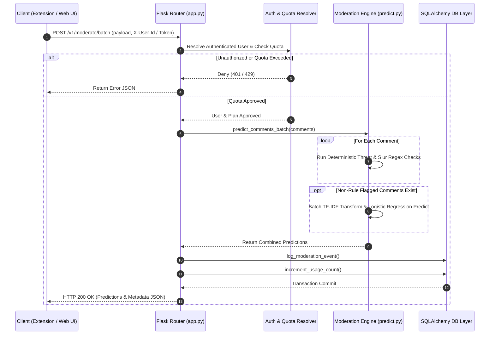
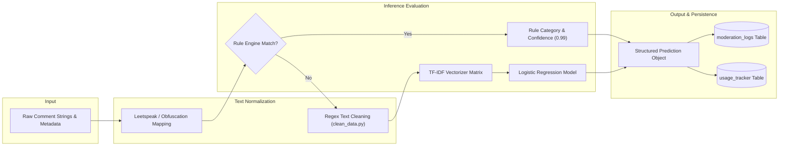

# System Architecture Discovery Document: Creator Safety Shield

## 1. Executive Summary

**Creator Safety Shield** is an AI-powered comment moderation platform and evidence vault designed to protect content creators from online harassment across web platforms (such as YouTube and Instagram). 

The platform operates as a hybrid architecture consisting of:
1. **A Web Application & REST API Service**: Built using Python Flask, serving server-side rendered playground interfaces and API endpoints.
2. **A Chrome Extension Client**: A browser content script that monitors social media DOM structures using a `MutationObserver` pattern, communicates with the backend via batch REST requests, and dynamically alters DOM elements (blurring toxic comments and displaying category badges).
3. **A Hybrid Moderation Engine**: Combines deterministic rule-based threat detection (regex patterns for slurs, evasions, profanity, death threats, and harassment) with a statistical scikit-learn machine learning pipeline (TF-IDF Vectorizer + Logistic Regression model).
4. **A Relational Data Layer**: Managed through SQLAlchemy ORM, backing moderation event logging ("Evidence Vault") and multi-tier usage tracking across guest, free, and pro subscription tiers.

---

## 2. Current Architecture Diagram

---

## 3. Request Flow Diagram

---

## 4. Data Flow Diagram

---

## 5. Component Inventory

| Component | Technology / Language | Location | Description |
| :--- | :--- | :--- | :--- |
| **Web Server & Routing** | Python / Flask | `app.py` | Core monolith entrypoint handling UI rendering, REST endpoints, auth headers, and quota control. |
| **Moderation Engine** | Python / Scikit-Learn | `model/predict.py` | Hybrid classifier containing regex threat patterns, Hinglish/Hindi profanity lexicons, and batch ML vectorization logic. |
| **Data Cleaning Pipeline** | Python / Regex | `preprocessing/clean_data.py` | Text normalization routines for stripping URLs, special characters, and extra whitespace. |
| **ML Artifacts** | Scikit-Learn / Pickle | `model/model.pkl`, `model/vectorizer.pkl` | Serialized Logistic Regression model and TF-IDF Vectorizer binaries loaded into memory at startup. |
| **Database Connection & ORM** | SQLAlchemy | `db/connection.py` | Schema definitions (`ModerationLog`, `UsageTracker`, `Subscription`), database connection engine, and CRUD utilities. |
| **Chrome Extension** | JavaScript (ES6) | `extension/content.js` | Client content script using `MutationObserver` to extract comments from YouTube/Instagram DOMs, trigger API batch requests, and apply DOM overlays. |
| **Web Playground UI** | Jinja2 / HTML5 / CSS | `templates/index.html` | Server-rendered frontend interface providing an interactive test playground, live evidence vault, and usage statistics dashboard. |
| **Deployment Configurations** | Docker / Vercel JSON | `Dockerfile`, `vercel.json` | Container configuration with Gunicorn WSGI server and serverless route definitions for Vercel deployment. |

---

## 6. Architecture Strengths

- **Unified API Contract**: Both the browser extension content script and the web playground UI consume the same underlying REST API endpoints (`/v1/moderate` and `/v1/moderate/batch`).
- **Two-Pass Hybrid Inference Design**: High-priority threat detection (rule-based) short-circuits execution before matrix transformation, bypassing the machine learning vectorizer for deterministic matches.
- **Asynchronous DOM Observing**: The browser extension uses a debounced `MutationObserver` rather than polling timers, triggering DOM node extraction and moderation batches only when page mutations occur.
- **Database Abstraction**: Use of SQLAlchemy ORM decouples application logic from the underlying storage engine, supporting embedded SQLite for development and PostgreSQL for production through configuration environment variables.

---

## 7. Architecture Weaknesses

- **In-Process Inference Execution**: Machine learning inference and regex parsing run directly inside the web server HTTP request handlers, coupling CPU-intensive ML workloads to web request threads.
- **Monolithic Runtime Boundary**: Server-side HTML rendering, REST API routing, user quota tracking, and ML prediction engines share a single application process and file structure.
- **Stateful Local Artifact Dependency**: ML model binaries (`model.pkl` and `vectorizer.pkl`) are loaded into process memory at script initialization rather than being served behind a dedicated inference service boundary.
- **Synchronous Data Access in Request Loop**: Quota verifications, log persistence, and usage counter increments perform synchronous SQL transactions within the main HTTP request-response cycle.
