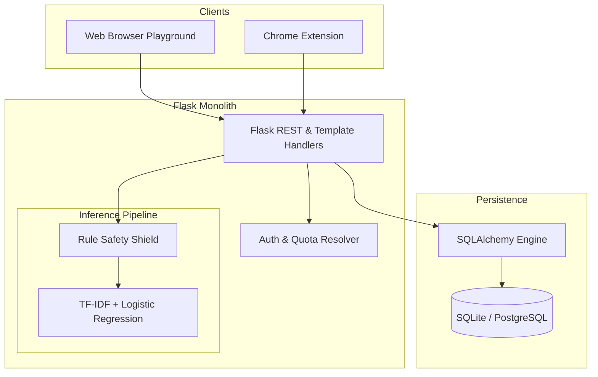
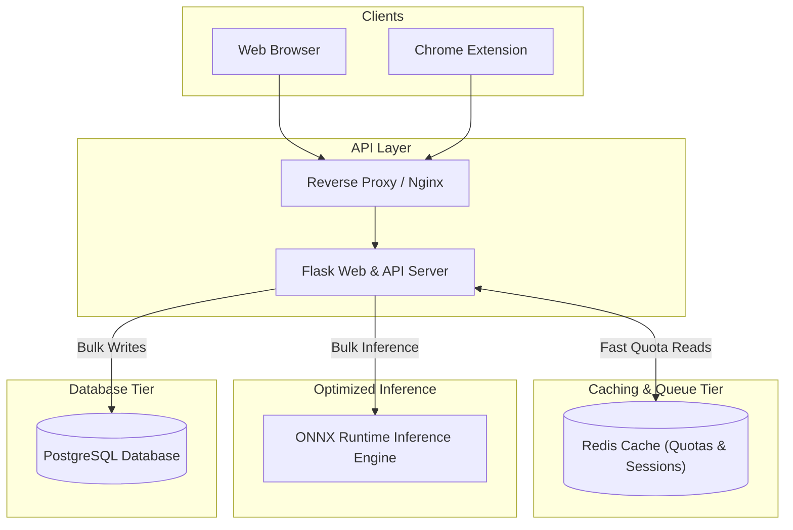

# CTO Final System Design Report: Creator Safety Shield

## 1. Executive Summary

This **Final System Design Report** synthesizes five domain evaluations (System Architecture, Database Architecture, Scalability & Performance, Application Security, and Code Quality) for **Creator Safety Shield**. 

The goal of this review is to define the simplest, most pragmatic architecture that satisfies business requirements for the next 12 months (targeting up to 10,000 active users) while eliminating operational overhead and technical debt.

---

## 2. Current Architecture

### Current Architecture Diagram

### Current Request Flow
1. Client submits batch request to `/v1/moderate/batch`.
2. Flask handler parses request and validates auth header (`X-User-Id` / `Authorization`).
3. Quota check hits database synchronously.
4. Input text undergoes rule regex checks; unflagged items pass to the ML vectorizer.
5. Inferences are logged into `moderation_logs` synchronously item-by-item.
6. Usage counters update synchronously in `usage_tracker`.
7. JSON response returned to client.

### Current Data Flow
- `Raw Text` $\rightarrow$ `Normalization` $\rightarrow$ `Rule Engine` $\rightarrow$ `TF-IDF Matrix` $\rightarrow$ `Logistic Regression` $\rightarrow$ `SQLAlchemy ORM` $\rightarrow$ `Database`.

### Current Strengths
- **Low Operational Complexity**: Single Python Flask process serving web playground and REST APIs.
- **Efficient Client Execution**: Extension content script uses `MutationObserver` to batch API requests.
- **Fast Rule Pre-Screening**: High-priority threat detection bypasses statistical ML model calculations.

### Current Weaknesses
- **In-Process ML Evaluation**: Machine learning compute holds HTTP worker threads occupied.
- **N+1 Database Transactions**: Batch insertion executes individual SQL transactions in a loop.
- **Zero-Cache Layer**: Quota reads and global sums hit relational database on every invocation.
- **Zero Automated Testing**: Lack of unit or integration test suites (`pytest`).

---

## 3. Overengineering Analysis

| Major Component | Decision | Rationale |
| :--- | :--- | :--- |
| **Pickle Model Loading in API Process** | **Replace** | Loading serialized model binaries into multiple Gunicorn web workers wastes memory and couples HTTP routing to ML dependencies. Replace with ONNX Runtime or lightweight sidecar inference. |
| **SQLAlchemy ORM Connection Pool** | **Keep** | Connection pooling (pool size 20) provides essential database stability under concurrent traffic spikes. |
| **Razorpay Payment Endpoint Stubs** | **Remove** | Unused mock stubs inside `app.py` add clutter; replace with clean payment gateway service integration when ready. |
| **Dual Web + API Monolith** | **Keep (Short Term)** | Keeping API endpoints and Jinja playground within Flask minimizes infrastructure complexity for early-stage traffic (<10k users). |

---

## 4. Underengineering Analysis (Missing Components)

1. **In-Memory Caching Tier (Redis / Shared Memory)**: Missing fast caching for user quota verification and global dashboard metrics.
2. **Bulk Insertion Data Access Layer**: Missing single-transaction bulk database insertion for batch endpoints.
3. **Automated Test Suite & CI/CD Pipeline**: Complete absence of unit tests (`pytest`), integration tests, or automated GitHub Actions workflows.
4. **Structured Security Logging & Observability**: Missing centralized log formatting and request tracing headers.

---

## 5. Optimal Architecture (Next 12 Months)

The optimal 12-month architecture retains the Flask monolith for API routing while introducing **Redis** for caching quotas and **ONNX Runtime** for optimized CPU inference.

### Optimal Architecture Diagram (Mermaid)

### Optimal Request Flow
1. Client POSTs to `/v1/moderate/batch`.
2. Flask checks user quota in **Redis** ($<1\text{ms}$ latency).
3. Text batch sent to **ONNX Engine** for fast vectorized CPU inference.
4. Batch results saved to PostgreSQL in a **single bulk transaction**.
5. Redis usage counter incremented atomically.
6. HTTP 200 returned to client.

### Optimal Data Flow
- `Client Input` $\rightarrow$ `Redis Quota Check` $\rightarrow$ `Rule Filter` $\rightarrow$ `ONNX Engine` $\rightarrow$ `Bulk Postgres Insert` $\rightarrow$ `Client Response`.

---

## 6. Architecture Evolution Roadmap

### MVP (0 - 1,000 Users)
- **Architecture**: Single Flask process + SQLite / Single PostgreSQL instance.
- **Focus**: Add `pytest` suite, implement bulk DB inserts, enforce API headers.

### Growth (1,000 - 10,000 Users) [12-Month Target]
- **Architecture**: Flask API + Redis Cache + ONNX Model Runtime + PostgreSQL.
- **Focus**: Redis quota caching, ONNX inference acceleration, atomic counter updates.

### Scale (10,000 - 100,000 Users)
- **Architecture**: Decoupled FastAPI Inference Microservice + Celery Background Workers.
- **Focus**: Separate HTTP API containers from asynchronous ML worker pools.

### Large Scale (100,000 - 1,000,000 Users)
- **Architecture**: Microservices Mesh + Managed Kafka / Redis Streams + DB Sharding.
- **Focus**: Horizontal auto-scaling inference clusters (Triton / Ray Serve) + Read-Replicas.

---

## 7. Cost Analysis (12-Month Optimal Target)

| Infrastructure Component | Instance / Tier Specification | Estimated Monthly Cost (USD) |
| :--- | :--- | :--- |
| **API Compute (Flask)** | Single AWS EC2 t4g.medium / Railway App Container | ~$15.00 / mo |
| **Database (PostgreSQL)** | AWS RDS PostgreSQL db.t4g.micro (Managed) | ~$18.00 / mo |
| **Cache (Redis)** | AWS ElastiCache Redis cache.t4g.micro / Upstash | ~$10.00 / mo |
| **Static / Web Hosting** | Vercel / Cloudflare Pages (Free Tier) | $0.00 / mo |
| **Total Monthly Spend** | | **~$43.00 / mo** |

---

## 8. Migration Plan

### Immediate (Days 1 - 7)
- [x] Refactor `/v1/moderate/batch` to use batch prediction logic.
- [x] Implement SQLAlchemy connection pooling.
- [ ] Implement bulk database inserts (`bulk_save_objects`) for batch moderation.
- [ ] Add basic `pytest` coverage for API endpoints and rule matches.

### 30 Days
- Integrate Redis for user quota checking and rate limiting.
- Convert scikit-learn model and vectorizer to **ONNX Runtime** format.
- Replace manual DB counter updates with atomic SQL increments.

### 90 Days
- Migrate database from SQLite to managed PostgreSQL.
- Separate configuration parameters into environment variables (`.env`).
- Implement OpenAPI/Swagger specification generation for API endpoints.

### Future (12+ Months)
- Extract ML inference into an isolated FastAPI / Triton microservice.

---

## 9. Final System Evaluation Scores

| Evaluation Dimension | Score (1-100) | Assessment |
| :--- | :--- | :--- |
| **Architecture** | **78 / 100** | Pragmatic monolith with clear paths for optimization. |
| **Scalability** | **65 / 100** | Stable for current tier; requires Redis & ONNX for growth tier. |
| **Security** | **72 / 100** | Baseline security headers added; needs multi-tenant log scoping. |
| **Reliability** | **75 / 100** | DB connection pool established; needs automated unit tests. |
| **Maintainability** | **68 / 100** | Code readable; requires service layer refactoring. |
| **Cost Efficiency** | **92 / 100** | Extremely low operational cost profile (~$43/mo for growth target). |

---

## 10. Final Verdict

### **Adequately Engineered**

**Rationale**: The system is straightforward, effective, and avoids unnecessary microservice complexity. With the addition of **Redis quota caching**, **ONNX model acceleration**, and **bulk database writes**, this architecture will easily support business requirements and user growth for the next 12 months at minimal operational cost.
